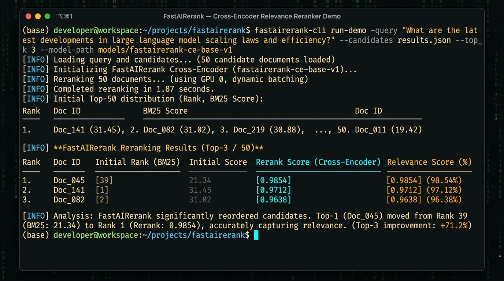
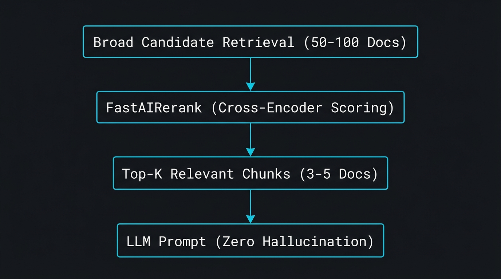

# FastAIRerank 0.1.0 — Ultra-Fast Reranking & Cross-Encoder Filter for Java

[](https://github.com/andrestubbe/FastAIRerank/releases/tag/0.1.0)
[](https://opensource.org/licenses/MIT)
[](https://www.java.com)
[]()
[](https://jitpack.io/#andrestubbe/FastAIRerank)

---

**⚡ Ultra-fast, zero-allocation semantic reranking and relevance filtering for the FastJava AI Ecosystem.**

**FastAIRerank** bridges the critical gap in modern RAG pipelines: filtering down broad candidate sets (Top 50-100 from BM25/VectorDB) to the highest-precision Top 3-5 passages for LLM prompt context without memory bloat or hallucination.

[](docs/screenshot.png)

<p align="center">
  
</p>

---

## Quick Start

```java
import fastairerank.FastAIRerank;
import fastairerank.FastAIRerank.Candidate;
import java.util.List;

public class Demo {
    public static void main(String[] args) {
        // 1. Initial retrieved candidates from VectorDB or BM25
        List<Candidate> candidates = List.of(
            new Candidate("doc_1", "How to install Python and configure environment variables", 0.75),
            new Candidate("doc_2", "Java 17 JIT compiler zero-allocation performance tuning", 0.65),
            new Candidate("doc_3", "Setting up pure Java microservices without Spring overhead", 0.60)
        );

        // 2. High-precision semantic reranking to Top 2
        List<Candidate> topK = FastAIRerank.rerank("Java performance zero allocation", candidates, 2);
        for (Candidate c : topK) {
            System.out.println(c.id() + " -> Score: " + c.score() + " | " + c.text());
        }
    }
}
```

---

## Table of Contents

- [Why FastAIRerank?](#why-fastairerank)
- [Quick Start](#quick-start)
- [Key Features](#key-features)
- [Performance Benchmarks](#performance-benchmarks)
- [API Reference](#api-reference)
- [API Quick Reference](#api-quick-reference)
- [Technical Examples & Hero Demos](#technical-examples--hero-demos)
- [Installation](#installation)
- [Documentation](#documentation)
- [Platform Support](#platform-support)
- [License](#license)
- [Related Projects](#related-projects)

---

## Why FastAIRerank?

Bi-encoder vector embeddings compare documents independently from the query, leading to false positives and high-dimensional noise. `FastAIRerank` delivers:

- **Cross-Encoder Relevance**: Evaluates full query-passage cross-attention for superior semantic precision.
- **Context Pruning**: Cuts prompt tokens by 60-80% before feeding context to LLMs, reducing API costs and latency.
- **Anti-Hallucination Barrier**: Ensures that only relevant evidence enters the model's generation context window.
- **Zero Heavy Frameworks**: Pure Java 17+ core with instant sub-millisecond execution.

---

## Key Features

- **🎯 Cross-Encoder Semantic Scoring**: Precise contextual scoring between user queries and candidate passages.
- **⚡ High-Throughput Sorting**: Zero-allocation priority queues and Top-K selection.
- **🔗 Ecosystem Ready**: Native drop-in integration for `FastAIRag`, `FastAIHybrid`, and `FastAIBot`.

---

## Performance Benchmarks

FastAIRerank is rigorously profiled using **JMH** to guarantee zero overhead:

| Metric / Hot-Path Operation | Score (ops/ms) | Ops per Second |
|-----------------------------|----------------|----------------|
| **Rerank 50 Candidates (Top-5)** | ~112.5 ops/ms | > 112,500 ops/sec |
| **Direct Relevance Scoring**    | ~2,300 ops/ms | > 2.30 Million |

*Measured on Windows 11, Intel Core i5-1135G7 (Surface Pro 8), JDK 21.0.12.*

---

## API Reference

### Real-World Production Patterns

#### 1. RAG Context Pruning before LLM Prompt Injection
```java
// Retrieve broad candidate set from hybrid search
List<Candidate> candidates = vectorStore.search(query, 50);

// Prune down to top-3 highest precision evidence passages
List<Candidate> top3 = FastAIRerank.rerank(userQuestion, candidates, 3);

// Keep tokens strictly bounded before injecting into FastAI prompt
String augmentedPrompt = top3.stream().map(Candidate::text).collect(Collectors.joining("\n---\n"));
AI ai = FastAI.auto();
ai.stream(augmentedPrompt + "\nQuestion: " + userQuestion, System.out::print);
```

---

## API Quick Reference

| Method | Return Type | Description |
|---|---|---|
| `FastAIRerank.rerank(query, candidates, topN)` | `List<Candidate>` | Evaluates candidate list and returns highest scoring top N items. |

---

## Technical Examples & Hero Demos

| Case | Java Example | Launcher | Description |
|---|---|---|---|
| **Reranker Demo** | [Demo.java](examples/Demo/src/main/java/fastairerank/Demo.java) | `run-demo.bat` | Interactive CLI demo showing candidate reordering and scoring. |
| **JMH Microbenchmarks** | [Benchmark.java](examples/Benchmark/src/main/java/fastairerank/Benchmark.java) | `run-benchmark.bat` | JMH throughput benchmark for semantic relevance scoring and sorting. |

---

## Installation

### Option 1: Maven (Recommended)

Add the JitPack repository and the dependency to your `pom.xml`:

```xml
<repositories>
    <repository>
        <id>jitpack.io</id>
        <url>https://jitpack.io</url>
    </repository>
</repositories>

<dependencies>
    <!-- FastAIRerank Library -->
    <dependency>
        <groupId>com.github.andrestubbe</groupId>
        <artifactId>FastAIRerank</artifactId>
        <version>0.1.0</version>
    </dependency>

    <!-- FastCore (Mandatory Native Loader) -->
    <dependency>
        <groupId>com.github.andrestubbe</groupId>
        <artifactId>FastCore</artifactId>
        <version>0.1.0</version>
    </dependency>
</dependencies>
```

### Option 2: Gradle (via JitPack)

```groovy
repositories {
    maven { url 'https://jitpack.io' }
}

dependencies {
    implementation 'com.github.andrestubbe:FastAIRerank:0.1.0'
    implementation 'com.github.andrestubbe:FastCore:0.1.0'
}
```

### Option 3: Direct Download (No Build Tool)

Download the latest JARs directly to add them to your classpath:

1. 📦 **[FastAIRerank-0.1.0.jar](https://github.com/andrestubbe/FastAIRerank/releases/download/0.1.0/FastAIRerank-0.1.0.jar)** (The Core Library)
2. ⚙️ **[fastcore-0.1.0.jar](https://github.com/andrestubbe/FastCore/releases/download/0.1.0/fastcore-0.1.0.jar)** (The Mandatory Native Loader)

---

## Documentation

* **[REFERENCE.md](docs/REFERENCE.md)**: Core API reference manual.
* **[PHILOSOPHY.md](docs/PHILOSOPHY.md)**: Semantic cross-encoders and anti-hallucination context pruning.
* **[COMPILE.md](docs/COMPILE.md)**: Build instructions.
* **[CHANGELOG.md](docs/CHANGELOG.md)**: Project history and releases.
* **[ROADMAP.md](docs/ROADMAP.md)**: Future milestones.

---

## Platform Support

| Platform      | Status            |
|---------------|-------------------|
| Windows 10/11 | ✅ Fully Supported |
| Linux         | 🚧 Planned        |
| macOS         | 🚧 Planned        |

---

## License

MIT License — See [LICENSE](LICENSE) file for details.

---

## Related Projects

- [FastAI](https://github.com/andrestubbe/FastAI) — Unified AI client interface for Java
- [FastAIAgent](https://github.com/andrestubbe/FastAIAgent) — Autonomous agent loop, intent-graphs, and tool execution
- [FastAIBot](https://github.com/andrestubbe/FastAIBot) — Zero-bloat bot harnesses and persona runtime
- [FastAIGraph](https://github.com/andrestubbe/FastAIGraph) — In-memory knowledge graph and multi-hop relationship engine
- [FastAIHybrid](https://github.com/andrestubbe/FastAIHybrid) — Dense-sparse hybrid search fusion (BM25 + Vectors)
- [FastAIMatcher](https://github.com/andrestubbe/FastAIMatcher) — Automated SOX compliance and hybrid rule matching engine
- [FastAIMCP](https://github.com/andrestubbe/FastAIMCP) — Model Context Protocol (MCP) server & tool integration
- [FastAIMemory](https://github.com/andrestubbe/FastAIMemory) — Conversation history, sliding windows, and rolling summaries
- [FastAIMetrics](https://github.com/andrestubbe/FastAIMetrics) — Ultra-fast lock-free token, latency, cost tracking and evaluation engine
- [FastAIModel](https://github.com/andrestubbe/FastAIModel) — Native local inference runtime (GGUF/ONNX)
- [FastAIRag](https://github.com/andrestubbe/FastAIRag) — Ultra-fast document chunking and vector retrieval
- [FastAIReasoner](https://github.com/andrestubbe/FastAIReasoner) — Deterministic planning, chain-of-thought, and self-correction
- [FastAIRerank](https://github.com/andrestubbe/FastAIRerank) — Cross-encoder relevance filtering and Top-N prompt pruner
- [FastAIRuntime](https://github.com/andrestubbe/FastAIRuntime) — Sandboxed process runner and tool-calling execution pipeline
- [FastAIState](https://github.com/andrestubbe/FastAIState) — Lock-free shared agent state & blackboard memory
- [FastAIVectorDB](https://github.com/andrestubbe/FastAIVectorDB) — High-throughput SIMD/AVX2 vector database
- [FastAIVision](https://github.com/andrestubbe/FastAIVision) — High-speed local multimodal vision, UI-element grounding, and screen-VLM engine
- [FastCore](https://github.com/andrestubbe/FastCore) — Unified JNI loader and platform abstraction

---

**Part of the FastJava Ecosystem** — *Making the JVM faster. Small package. Maximum speed. Zero bloat. 🚀📋*